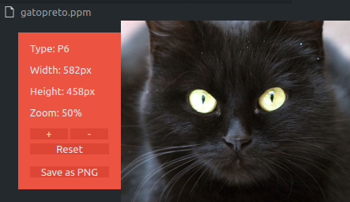
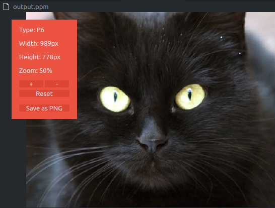

# Transformação Linear de Imagens PPM

Um programa em C para realizar transformações lineares em imagens PPM. Este projeto foi desenvolvido como parte do curso no Departamento de Matemática da Universidade Federal de Sergipe, sob a supervisão do Prof. Evilson Vieira.

## Compilação e Execução

- **Compilar:** Utilize o comando `gcc -o fator fator.c -lm` para compilar o código.
- **Executar:** Rode o programa usando `./fator gatopreto.ppm`, substituindo `gatopreto.ppm` pelo nome do arquivo PPM que deseja.

## Resultados

### Entrada

    

### Saída

    

